# RKLLM API Server

**OpenAI-compatible API server for Rockchip NPU (RK3588/RK3576) running RKLLM models, designed as a drop-in backend for [Open WebUI](https://github.com/open-webui/open-webui).**

Built for single-board computers like the **Orange Pi 5 Plus**, this server bridges the gap between the `rkllm` C++ runtime and any OpenAI-compatible frontend — enabling local, private LLM inference on ARM hardware with zero cloud dependency.

---

## Table of Contents

- [Features](#features)
- [Architecture](#architecture)
- [Requirements](#requirements)
- [Installation](#installation)
  - [RKNPU Driver 0.9.8](#2-rknpu-driver-098)
  - [RKLLM Runtime v1.2.3](#3-rkllm-runtime-v123)
- [Pre-Built Models](#pre-built-models)
- [Model Setup](#model-setup)
- [Running the Server](#running-the-server)
- [API Endpoints](#api-endpoints)
- [Open WebUI Configuration](#open-webui-configuration)
- [SearXNG Configuration](#searxng-configuration)
- [RAG Pipeline](#rag-pipeline)
- [Reasoning Models](#reasoning-models)
- [Configuration Reference](#configuration-reference)
- [Logging](#logging)
- [Security](#security)
- [Troubleshooting](#troubleshooting)
- [License](#license)

---

## Features

### Core
- **OpenAI-compatible API** — `/v1/chat/completions`, `/v1/models` endpoints work with any OpenAI client
- **Streaming & non-streaming** responses with proper SSE (Server-Sent Events) format
- **Auto-detection** of all `.rkllm` models in `~/models` directory
- **Context length auto-detection** from filename patterns (2k/4k/8k/16k/32k)
- **Auto-generated aliases** — short names like `qwen`, `deepseek` resolve automatically
- **Process reuse** for fast follow-up requests (no reload between turns)
- **Model hot-switching** — request a different model and it loads automatically
- **On-demand loading** via `/v1/models/select` for warm-up
- **Explicit unloading** via `/v1/models/unload` to free NPU memory

### Robustness
- **Request tracking** with automatic stale-request cleanup (prevents deadlocks)
- **Process health monitoring** with auto-recovery (background thread)
- **Idle auto-unload** — frees NPU memory after configurable idle period
- **Graceful shutdown** on SIGTERM/SIGINT with process cleanup
- **Bleed-through prevention** — process killed on interrupted generation to prevent leftover output contaminating the next response
- **RLock-based locking** — fixes model switch deadlock scenarios
- **SIGKILL for reliability** — aggressive unloading ensures NPU is fully released
- **Residual data guard** — discards output arriving faster than NPU prefill time

### RAG (Retrieval-Augmented Generation)
- **Automatic RAG detection** when Open WebUI injects web search results
- **Smart prompt restructuring** — reading comprehension format optimized for small models
- **4-pass web content cleaning** — strips navigation, boilerplate, cookie banners
- **Score-based paragraph selection** — jusText-inspired content quality scoring
- **Near-duplicate removal** — Jaccard similarity deduplication across sources
- **Quality floor** — drops irrelevant search results instead of confusing the model
- **Follow-up detection** — 3-layer system prevents RAG on conversational replies
- **Response caching** — LRU cache eliminates redundant inference for repeated questions
- **Context-dependent thinking** — disables reasoning on small context models to save tokens

### Reasoning Model Support
- **`<think>` tag parsing** for Qwen3 and similar reasoning models
- **`reasoning_content`** field in both streaming deltas and non-streaming responses
- **Streaming state machine** handles tags split across output chunks
- **Open WebUI integration** — reasoning appears as collapsible thinking blocks

### Standards Compliance
- **`stream_options.include_usage`** — streaming token counts per OpenAI spec
- **`system_fingerprint`** in all responses
- **`max_tokens` / `max_completion_tokens`** support
- **Request body size limit** (16 MB)
- **Proper error responses** matching OpenAI error format

---

## Architecture

```mermaid
graph TD
    OW["🌐 Open WebUI"] -- "OpenAI API · HTTP/SSE" --> API
    OW -. "Ollama API · HTTP" .-> OL["🦙 Ollama<br/>(CPU Models)"]
    OW -- "Search Query" --> SX["🔎 SearXNG"]
    SX -- "Results" --> OW

    API["📡 API Endpoint<br/>/v1/chat/completions"] --> BP["🔧 Prompt Builder<br/>RAG · Web Cleaning<br/>Score Selection"]
    BP --> RC["💾 RAG Cache<br/>LRU · TTL"]

    API -- "stdin · plain text" --> RKLLM["⚡ rkllm C++<br/>Chat Template<br/>Token Sampling"]
    RKLLM -- "stdout · tokens + stats" --> TP["🧠 Think Parser<br/>‹think› Tags<br/>State Machine"]
    TP -- "SSE chunks" --> API

    RKLLM --> NPU["🔲 RK3588 NPU<br/>6 TOPS × 3 cores"]

    PM["🔍 Process Monitor<br/>Health · Recovery<br/>Idle Unload"] -. "monitor · kill/restart" .-> RKLLM

    style OW fill:#4a9eff,stroke:#2d7cd4,color:#fff
    style OL fill:#f5f5f5,stroke:#999,color:#333
    style API fill:#2ecc71,stroke:#27ae60,color:#fff
    style BP fill:#3498db,stroke:#2980b9,color:#fff
    style PM fill:#e67e22,stroke:#d35400,color:#fff
    style RC fill:#9b59b6,stroke:#8e44ad,color:#fff
    style TP fill:#1abc9c,stroke:#16a085,color:#fff
    style RKLLM fill:#e74c3c,stroke:#c0392b,color:#fff
    style NPU fill:#2c3e50,stroke:#1a252f,color:#fff
    style SX fill:#f39c12,stroke:#e67e22,color:#fff
```



**Key design decisions:**

1. **Plain text only** — The `rkllm` binary applies chat templates internally using actual token IDs. Special tokens (`<|im_start|>`, `<start_of_turn>`, etc.) are stripped from the text vocabulary during model conversion. Sending them as literal text causes the model to see garbage.

2. **Single worker** — The NPU can only load one model at a time. The server enforces `-w 1` (one gunicorn worker) and rejects concurrent requests with HTTP 503.

3. **Kill on interrupt** — The `rkllm` binary uses synchronous `rkllm_run()` which cannot be cancelled. On client disconnect or timeout, the process is killed and restarted to prevent output contamination.

---

## Requirements

### Tested System

This project was developed and tested on:

| Component | Details |
|-----------|--------|
| **Board** | Orange Pi 5 Plus (16 GB RAM) |
| **SoC** | Rockchip RK3588 (3 NPU cores) |
| **OS** | [Armbian Pelochus 24.11.0](https://github.com/Pelochus/armbian-build-rknpu-updates/releases) — `Armbian-Pelochus_24.11.0-OrangePi5-plus_jammy_vendor.7z` |
| **Kernel NPU Driver** | 0.9.8 (**included in the Pelochus image** — no driver build required) |
| **RKLLM Runtime** | v1.2.3 (only the runtime library + binary need to be installed) |

> **Why Pelochus Armbian?** The standard Armbian images ship with an older RKNPU driver (0.9.6 or earlier). The [Pelochus builds](https://github.com/Pelochus/armbian-build-rknpu-updates/releases) bundle **RKNPU driver 0.9.8** in the kernel, so you only need to install the RKLLM runtime — no kernel module compilation required.

### Hardware
- **Rockchip RK3588 or RK3576** SBC (Orange Pi 5 Plus, Rock 5B, etc.)
- **NPU driver** installed and functional
- Minimum **8GB RAM** recommended (16GB for larger models)

### Software
- **Linux** (ARM64) — tested on Ubuntu/Debian (Armbian)
- **Python 3.8+**
- **RKNPU driver ≥ 0.9.6** (0.9.8 recommended — see [Driver Setup](#rknpu-driver-098) below)
- **RKLLM Runtime v1.2.3** — the C++ inference runtime (see [Runtime Setup](#rkllm-runtime-v123) below)
- **RKLLM models** (`.rkllm` format) placed in `~/models/`

### Python Dependencies
```bash
pip install flask flask-cors gunicorn gevent
```

---

## Installation

### Automated Setup (Experimental)

> **⚠️ Note:** This script has not been fully tested on a clean system yet. It is provided as a convenience and should work on Armbian/Ubuntu aarch64 systems, but please review the output carefully and report any issues.

A zero-configuration setup script is included that handles **everything** — system packages, Python venv, RKLLM runtime compilation, kernel module/driver verification, udev rules, systemd service, and NPU frequency fix:

```bash
git clone https://github.com/GatekeeperZA/RKLLM-API-Server.git
cd RKLLM-API-Server
chmod +x setup.sh
./setup.sh
```

> **Do NOT run as root.** The script uses `sudo` internally only where needed (installing system packages, copying libraries, creating the systemd service). User-level files (venv, models directory) are owned by your normal account.

The script is **idempotent** — safe to run multiple times. It detects what's already installed and skips those steps.

**What it installs / verifies:**
- System packages: `python3`, `python3-venv`, `python3-pip`, `build-essential`, `git`, `git-lfs`
- RKNPU kernel module check (`lsmod`, `modinfo`, `/dev/rknpu`, udev rules, `render` group)
- RKLLM Runtime: `librkllmrt.so` → `/usr/lib/`, `rkllm` binary → `/usr/local/bin/`
- Python venv (`.venv`) with `flask`, `flask-cors`, `gunicorn`, `gevent`
- Systemd services: `rkllm-api` (API server) + `fix-freq` (NPU/CPU frequency governor)

After setup, download a model and start the service:
```bash
# Download Qwen3-1.7B (recommended)
mkdir -p ~/models/Qwen3-1.7B-4K && cd ~/models/Qwen3-1.7B-4K
git lfs install && git clone https://huggingface.co/GatekeeperZA/Qwen3-1.7B-RKLLM-v1.2.3 .

# Start the server
sudo systemctl start rkllm-api

# Check status
sudo systemctl status rkllm-api
curl http://localhost:8000/v1/models
```

---

### Manual Installation

<details>
<summary>Click to expand manual step-by-step instructions</summary>

#### 1. Clone This Repository

```bash
git clone https://github.com/GatekeeperZA/RKLLM-API-Server.git
cd RKLLM-API-Server

# Install Python dependencies
pip install flask flask-cors gunicorn gevent

# Create models directory
mkdir -p ~/models
```

#### 2. RKNPU Driver 0.9.8

The RKNPU kernel driver enables communication with the NPU hardware. Some board images ship with an older driver — you need **≥ 0.9.6** (0.9.8 recommended).

**Check your current driver version:**
```bash
dmesg | grep -i rknpu
# Look for a line like: "RKNPU driver loaded version 0.9.8"
# or:
cat /sys/kernel/debug/rknpu/version 2>/dev/null || echo "Check dmesg"
```

**If you need to update:**

The driver source is included in the [rknn-llm](https://github.com/airockchip/rknn-llm) repository as a pre-built tarball. It must be compiled against your running kernel's headers.

```bash
# Clone the rknn-llm repo (if not already done)
git clone https://github.com/airockchip/rknn-llm.git
cd rknn-llm/rknpu-driver

# Extract the driver source
tar xjf rknpu_driver_0.9.8_20241009.tar.bz2
cd rknpu_driver_0.9.8

# Install kernel headers (required for compilation)
sudo apt update
sudo apt install -y linux-headers-$(uname -r) build-essential

# Build the driver module
make -C /lib/modules/$(uname -r)/build M=$(pwd)/drivers/rknpu modules

# Install the new driver
sudo cp drivers/rknpu/rknpu.ko /lib/modules/$(uname -r)/kernel/drivers/rknpu/
sudo depmod -a

# Load the new driver (or reboot)
sudo modprobe -r rknpu 2>/dev/null  # unload old
sudo modprobe rknpu                  # load new

# Verify
dmesg | tail -5 | grep -i rknpu
```

> **Note:** Many Armbian and Orange Pi images already include RKNPU driver 0.9.8. Check before building. If `dmesg | grep rknpu` shows `0.9.8`, you're good.

> **Recommended:** The [Pelochus Armbian builds](https://github.com/Pelochus/armbian-build-rknpu-updates/releases) ship with RKNPU driver 0.9.8 pre-installed — no manual driver compilation needed. Use `Armbian-Pelochus_24.11.0-OrangePi5-plus_jammy_vendor.7z` (or the latest release for your board) and skip straight to the [Runtime Setup](#3-rkllm-runtime-v123).

> **Alternative:** Some distributions update the driver via a board-specific kernel update: `sudo apt upgrade` may pull in a newer kernel with the driver included.

#### 3. RKLLM Runtime v1.2.3

The RKLLM runtime provides the `librkllmrt.so` shared library and the demo binary that this API server uses. You need to:
1. Install the shared library so the `rkllm` binary can find it
2. Compile the `llm_demo` binary (the `rkllm` binary this server calls)

```bash
# Clone the rknn-llm repo (if not already done)
git clone https://github.com/airockchip/rknn-llm.git
cd rknn-llm

# --- Install the runtime library ---
sudo cp rkllm-runtime/Linux/librkllm_api/aarch64/librkllmrt.so /usr/lib/
sudo ldconfig

# Verify the library is findable
ldconfig -p | grep rkllm
# Should show: librkllmrt.so => /usr/lib/librkllmrt.so
```

**Compile the `llm_demo` binary natively on your board (aarch64):**

```bash
cd examples/rkllm_api_demo/deploy

# Compile (natively on the RK3588 board)
g++ -O2 -o rkllm src/llm_demo.cpp \
    -I../../../rkllm-runtime/Linux/librkllm_api/include \
    -L../../../rkllm-runtime/Linux/librkllm_api/aarch64 \
    -lrkllmrt -lpthread

# Install to PATH
sudo cp rkllm /usr/local/bin/
rkllm --help  # or run with a model to test
```

> **For thinking models (Qwen3, DeepSeek-R1):** You must edit `src/llm_demo.cpp` to enable thinking mode before compiling. Add `rkllm_input.enable_thinking = true;` — see the [Qwen3 model card](https://huggingface.co/GatekeeperZA/Qwen3-1.7B-RKLLM-v1.2.3) for the exact code change.

**Verify everything works:**
```bash
# Check RKNPU driver
dmesg | grep -i rknpu

# Check runtime library
ldconfig -p | grep rkllm

# Check binary
which rkllm
rkllm ~/models/Qwen3-1.7B-4K/Qwen3-1.7B-w8a8-rk3588.rkllm 2048 4096
# Should print "rkllm init success" then wait for input
```

#### 4. Fix NPU Frequency (Recommended)

For consistent performance, pin the NPU and CPU frequencies. The rknn-llm repo includes scripts for this:

```bash
cd rknn-llm/scripts

# RK3588
sudo bash fix_freq_rk3588.sh

# RK3576 (if using that platform)
sudo bash fix_freq_rk3576.sh
```

> Run this after each reboot, or add it to `/etc/rc.local` for persistence.

#### 5. Enable Performance Logging (Optional)

To see token speed and generation stats in the output:
```bash
export RKLLM_LOG_LEVEL=1
```

This API server sets `RKLLM_LOG_LEVEL=1` automatically for the subprocess (parses `[Token/s]`, `[Tokens]`, `[Seconds]` from the output).

</details>

---

## Pre-Built Models

Ready-to-run `.rkllm` models converted by the author for RK3588 NPU are available on HuggingFace:

| Model | Parameters | Quant | Context | Speed | RAM | Thinking | Link |
|-------|-----------|-------|---------|-------|-----|----------|------|
| **Qwen3-1.7B** | 1.7B | w8a8 | 4,096 | ~13.6 tok/s | ~2 GB | ✅ Yes | [Download](https://huggingface.co/GatekeeperZA/Qwen3-1.7B-RKLLM-v1.2.3) |
| **Phi-3-mini-4k-instruct** | 3.82B | w8a8 | 4,096 | ~6.8 tok/s | ~3.7 GB | ❌ No | [Download](https://huggingface.co/GatekeeperZA/Phi-3-mini-4k-instruct-w8a8) |

> Browse all models: **[huggingface.co/GatekeeperZA](https://huggingface.co/GatekeeperZA)**

All models are converted with **RKLLM Toolkit v1.2.3**, targeting **RK3588 (3 NPU cores)**, and tested on an **Orange Pi 5 Plus** (16 GB RAM, RKNPU driver 0.9.8).

> **⚠️ DeepSeek-R1 on NPU — Currently Not Usable**
>
> DeepSeek-R1 (including distilled variants like DeepSeek-R1-Distill-Qwen-1.5B) **does not work correctly** with RKLLM Runtime v1.2.3. The model converts without errors but produces garbage output — repeating `[PAD151935]` tokens instead of real text ([rknn-llm#424](https://github.com/airockchip/rknn-llm/issues/424)). The model is also sensitive to quantization, and multi-turn conversations fail silently ([rknn-llm#277](https://github.com/airockchip/rknn-llm/issues/277)). The Airockchip team has acknowledged this is a known issue and stated it will be fixed in a future runtime version.
>
> **For NPU reasoning, use Qwen3-1.7B instead** — it supports `<think>` tags, runs at ~13.6 tok/s on the NPU, and works reliably with RKLLM v1.2.3.
>
> If you need DeepSeek-R1, run `deepseek-r1:7b` via **Ollama on CPU** — it works correctly (just slower, ~2-3 tok/s on RK3588 ARM cores). See [Using Ollama Alongside](#using-ollama-alongside-cpu-models) below.

### Quick Download

```bash
# Install git-lfs (required for large files)
sudo apt install git-lfs
git lfs install

# Qwen3-1.7B (thinking/reasoning model — recommended)
mkdir -p ~/models/Qwen3-1.7B-4K
cd ~/models/Qwen3-1.7B-4K
git clone https://huggingface.co/GatekeeperZA/Qwen3-1.7B-RKLLM-v1.2.3 .
# or download just the .rkllm file from the HuggingFace web UI

# Phi-3-mini (3.8B — strong at math/code, MIT licensed)
mkdir -p ~/models/Phi-3-mini-4k-instruct
cd ~/models/Phi-3-mini-4k-instruct
git clone https://huggingface.co/GatekeeperZA/Phi-3-mini-4k-instruct-w8a8 .
```

### Model Notes

**Qwen3-1.7B** — Hybrid thinking model. Produces `<think>...</think>` reasoning blocks that this API server parses into `reasoning_content` for Open WebUI's collapsible thinking display. Requires RKLLM Runtime ≥ v1.2.1 (v1.2.3 recommended) and `enable_thinking = true` in the C++ binary. Supports English and Chinese.

**Phi-3-mini-4k-instruct** — Microsoft's 3.8B parameter model excelling at reasoning, math (85.7% GSM8K), and code generation (57.3% HumanEval). English-primary. No thinking mode — this is a standard instruct model. MIT licensed.

> **Thinking mode requirement:** The compiled `rkllm` binary must have `enable_thinking = true` set in the source code for Qwen3 thinking to work. See the [Qwen3 model card](https://huggingface.co/GatekeeperZA/Qwen3-1.7B-RKLLM-v1.2.3) for compilation instructions.

---

## Model Setup

Place each `.rkllm` model in its own subfolder under `~/models/`:

```
~/models/
├── Qwen3-1.7B-4K/
│   └── Qwen3-1.7B-w8a8-rk3588.rkllm
├── Phi-3-mini-4k-instruct/
│   └── Phi-3-mini-4k-instruct-w8a8.rkllm
└── DeepSeek-R1-Distill-Qwen-1.5B-4K/
    └── DeepSeek-R1-Distill-Qwen-1.5B-4K.rkllm
```

### Context Length Detection

The server auto-detects context length from the filename or folder name:

| Pattern in name | Detected context |
|----------------|-----------------|
| `-2k` or `_2k` | 2,048 tokens |
| `-4k` or `_4k` | 4,096 tokens |
| `-8k` or `_8k` | 8,192 tokens |
| `-16k` or `_16k` | 16,384 tokens |
| `-32k` or `_32k` | 32,768 tokens |
| *(none found)* | 4,096 (default) |

### Auto-Generated Aliases

Model folder names are converted to IDs (lowercase, hyphens). Aliases are auto-generated:

| Model ID | Auto-Aliases |
|----------|-------------|
| `qwen3-1.7b-4k` | `qwen`, `qwen3` |
| `phi-3-mini-4k-instruct` | `phi`, `phi-3` |
| `deepseek-r1-distill-qwen-1.5b-4k` | `deepseek`, `deepseek-r1` |

Aliases are only created when unambiguous (one model claims the alias). If two models share a prefix, that alias is skipped.

---

## Running the Server

### Production (recommended)

```bash
gunicorn -w 1 -k gevent --timeout 300 -b 0.0.0.0:8000 api:app
```

> **Critical:** Always use `-w 1` (single worker). The NPU can only load one model at a time.

### Development

```bash
python api.py
```

This starts Flask's built-in server on `0.0.0.0:8000` with threading enabled.

### Systemd Service

```ini
[Unit]
Description=RKLLM API Server
After=network.target

[Service]
Type=simple
User=your-user
WorkingDirectory=/path/to/RKLLM-API-Server
ExecStart=/usr/bin/gunicorn -w 1 -k gevent --timeout 300 -b 0.0.0.0:8000 api:app
Restart=always
RestartSec=5
Environment=RKLLM_API_LOG_LEVEL=INFO

[Install]
WantedBy=multi-user.target
```

---

## API Endpoints

### `GET /v1/models`

List all detected models.

```bash
curl http://localhost:8000/v1/models
```

```json
{
  "object": "list",
  "data": [
    {
      "id": "qwen2.5-1.5b-instruct-4k",
      "object": "model",
      "created": 1738972800,
      "owned_by": "rkllm"
    }
  ]
}
```

### `POST /v1/chat/completions`

OpenAI-compatible chat completions (streaming and non-streaming).

```bash
# Non-streaming
curl http://localhost:8000/v1/chat/completions \
  -H "Content-Type: application/json" \
  -d '{
    "model": "qwen",
    "messages": [{"role": "user", "content": "What is the capital of France?"}]
  }'

# Streaming
curl http://localhost:8000/v1/chat/completions \
  -H "Content-Type: application/json" \
  -d '{
    "model": "qwen",
    "stream": true,
    "messages": [{"role": "user", "content": "What is the capital of France?"}]
  }'
```

**Supported parameters:**
| Parameter | Type | Default | Description |
|-----------|------|---------|-------------|
| `model` | string | *required* | Model ID or alias |
| `messages` | array | *required* | OpenAI messages format |
| `stream` | bool | `false` | Enable SSE streaming |
| `max_tokens` | int | `2048` | Max completion tokens |
| `stream_options.include_usage` | bool | `false` | Include token counts in stream |

### `POST /v1/models/select`

Pre-load a model without generating (warm-up).

```bash
curl -X POST http://localhost:8000/v1/models/select \
  -H "Content-Type: application/json" \
  -d '{"model": "qwen"}'
```

### `POST /v1/models/unload`

Explicitly unload the current model to free NPU memory.

```bash
curl -X POST http://localhost:8000/v1/models/unload
```

### `GET /health`

Health check endpoint.

```bash
curl http://localhost:8000/health
```

```json
{
  "status": "ok",
  "current_model": "qwen2.5-1.5b-instruct-4k",
  "process_healthy": true,
  "active_request": null,
  "models_available": 3
}
```

---

## Open WebUI Configuration

### Connection

In Open WebUI **Admin > Settings > Connections**, add the API as an OpenAI-compatible endpoint:

| Setting | Value |
|---------|-------|
| API Base URL | `http://<device-ip>:8000/v1` |
| API Key | *(any non-empty string — the server has no auth)* |

### Using Ollama Alongside (CPU Models)

Ollama can be installed on the same board and added as a **second connection** in Open WebUI. This gives you access to CPU-only models (e.g., larger models that don't have RKLLM conversions) alongside your NPU models — both appear in the model selector.

```bash
# Install Ollama on the same ARM board
curl -fsSL https://ollama.com/install.sh | sh

# Pull a model
ollama pull gemma2:2b
```

**Admin > Settings > Connections:**

Add Ollama as an additional connection (don't remove the RKLLM one):

| Setting | Value |
|---------|-------|
| Ollama API URL | `http://localhost:11434` |

Both backends appear in Open WebUI's model dropdown:
- **NPU models** (fast, via this RKLLM API server) — use for everyday chat and web search
- **CPU models** (slower, via Ollama) — use for larger models or architectures not yet supported by RKLLM

> **Note:** NPU and CPU inference don't conflict — they use different hardware. You can have an NPU model loaded via this server while Ollama runs a CPU model simultaneously.

**Recommended Ollama models for RK3588:**

```bash
# DeepSeek-R1 reasoning (works on CPU, broken on NPU — see Pre-Built Models note)
ollama pull deepseek-r1:7b

# Other useful CPU models
ollama pull gemma2:2b
ollama pull phi3:3.8b
```

> **CPU models (Ollama) do NOT need the NPU-specific settings.** The system prompt, disabled "Builtin Tools", and other restrictions documented below apply only to small NPU models served by this RKLLM API. Ollama models are larger, handle function-calling natively, and manage their own system prompts — leave their Open WebUI per-model settings at defaults.

### System Prompt (Required for All NPU Models)

**Workspace > Models > Edit** each NPU model, and set the **System Prompt** to:

```
Today is {{CURRENT_DATE}} ({{CURRENT_WEEKDAY}}), {{CURRENT_TIME}}.
```

> **Why this is required:** NPU models have no built-in awareness of the current date or time. Without this, any question like "what day is it?", "what happened today?", or "what's the weather now?" gets a hallucinated answer. Open WebUI replaces the `{{...}}` variables with live values before sending the request. The API server detects this date-only prompt and intelligently includes/omits it based on whether the user's question is date-related (prevents the model from fixating on the date for unrelated questions).

> **Do NOT add generic instructions** like "You are a helpful assistant" — these get sent to the rkllm binary as part of the user prompt and cause the model to respond with a greeting instead of answering the question. The API server automatically strips these if detected, but it's better to not include them at all.

### Web Search (Required for RAG/SearXNG)

**Admin > Settings > Web Search:**

| Setting | Value | Reason |
|---------|-------|--------|
| Search Engine | `searxng` | Self-hosted, JSON API |
| SearXNG Query URL | `http://searxng:8080/search` | Docker service name |
| Web Search Result Count | `3` (4k models) / `5` (16k models) | Balances coverage vs. context |
| **Bypass Web Loader** | **ON** ⚠️ | **Required.** Snippets are cleaner than raw page scraping for small models. SafeWebBaseLoader returns raw `get_text()` with all navigation/footer boilerplate |
| **Bypass Embedding and Retrieval** | **ON** ⚠️ | **Required.** No embedding model available on ARM/NPU. Skips ChromaDB vector search and sends docs directly to the model |

### Documents / RAG Template (Required for SearXNG)

**Admin > Settings > Documents:**

| Setting | Value | Reason |
|---------|-------|--------|
| **RAG Template** | `{{CONTEXT}}` | **Required.** Just the variable, nothing else. The default template is 300+ tokens of meta-instructions that waste context and encourage the model to use "own knowledge" instead of the search results |

> **Important:** The RAG Template must be exactly `{{CONTEXT}}` — no extra text, no instructions. The API server builds its own optimized reading-comprehension prompt format internally. Any additional template text gets prepended to the search results and wastes tokens.

### Per-Model Capabilities (Required)

**Workspace > Models > Edit > Capabilities** — configure for **each** NPU model:

| Setting | Value | Reason |
|---------|-------|--------|
| **Builtin Tools** | **OFF** ⚠️ | **Required.** Small NPU models (1.5B-4B) cannot do function-calling or tool-use. Leaving this on causes Open WebUI to inject tool-use instructions that confuse the model |
| File Context | **ON** | Enables document and search result injection into the conversation |

### Interface Settings (Recommended)

**Admin > Settings > Interface > Generation Settings:**

Disable **all** generation parameter controls (Temperature, Top-P, Top-K, etc.) in the chat interface. These sliders add unnecessary overhead — Open WebUI sends them with every request, and the `rkllm` binary manages its own sampling parameters internally. Leaving them enabled provides no benefit and can cause unexpected behaviour.

| Setting | Value | Reason |
|---------|-------|--------|
| **Show Generation Settings** | **OFF** | The RKLLM runtime handles sampling internally. UI sliders are ignored by the API but add request overhead |

---

## SearXNG Configuration

The included `settings.yml` is optimized for Open WebUI on ARM hardware. Key settings:

```yaml
use_default_settings:
  engines:
    keep_only:
      - google
      - google news
      - duckduckgo
      - bing
      - brave
      - wikipedia

search:
  formats:
    - html
    - json    # REQUIRED for Open WebUI API access
```

**Installation:**
```bash
cp settings.yml ~/Downloads/searxng-docker/searxng/settings.yml
cd ~/Downloads/searxng-docker
docker compose down && docker compose up -d
```

---

## RAG Pipeline

When Open WebUI performs a web search, the results are injected into the system message as `<source>` tags. The server detects this and activates a specialized RAG pipeline:

### Processing Steps

1. **Detection** — `<source>` tags in the system message trigger RAG mode
2. **Extraction** — Content extracted from between `<source>...</source>` tags
3. **Web Content Cleaning** (4-pass):
   - Pass 1: Remove known boilerplate phrases (cookies, sign-in, privacy policy, etc.)
   - Pass 2: Remove navigation patterns (CamelCase runs, title-case-heavy lines, URL clusters)
   - Pass 3: Collapse consecutive short-line menus (4+ short lines = navigation)
   - Pass 4: Keep only lines with data signals (digits, prose punctuation, ≥40 chars)
4. **Deduplication** — Exact prefix key + Jaccard word-similarity removal
5. **Score-based selection** — jusText-inspired paragraph scoring:
   - Stopword density (prose ≥ 30%, boilerplate < 15%)
   - Length, sentence count, data presence
   - Query keyword matching (3x weight)
   - Negative signals: short fragments, navigation patterns, boilerplate keywords
6. **Quality floor** — If best paragraph scores below threshold, RAG is dropped entirely
7. **Prompt construction** — SQuAD-style reading comprehension format:
   ```
   {reference data}

   According to the above, {question}. Answer in detail with specific facts and examples
   ```

### Follow-Up Detection (3 Layers)

Open WebUI searches SearXNG with the raw user message. Short follow-ups produce garbage results:

| Layer | Trigger | Example |
|-------|---------|---------|
| Layer 1: Word list | Exact match to known conversational words | "yes", "thanks", "tell me more" |
| Layer 2: Short query | ≤3 words with conversation history | "south africa", "another one" |
| Layer 3: Topical overlap | < 30% query keywords found in reference text | Off-topic search results |

When any layer fires, RAG is skipped and the model uses normal conversation mode.

### Response Cache

RAG responses are cached in an LRU cache (key: model + question hash) to avoid redundant NPU inference:

| Setting | Default | Description |
|---------|---------|-------------|
| `RAG_CACHE_TTL` | 300s | Cache lifetime |
| `RAG_CACHE_MAX_ENTRIES` | 50 | Max cached responses |

---

## Reasoning Models

Models like **Qwen3** output chain-of-thought wrapped in `<think>...</think>` tags.

The server:
- Parses these tags from the token stream using a state machine (handles tags split across chunks)
- Sends `reasoning_content` in streaming deltas (Open WebUI displays these as collapsible thinking blocks)
- Returns `reasoning_content` in non-streaming responses
- **Context-dependent thinking for RAG**: On small context models (< 8k), thinking is disabled via `/no_think` to save tokens for the actual answer

> **Note:** DeepSeek-R1 is currently **not usable on the NPU** with RKLLM Runtime v1.2.3 (produces `[PAD]` garbage tokens). Use **Qwen3-1.7B** for NPU reasoning, or run `deepseek-r1:7b` via Ollama on CPU. See the [Pre-Built Models](#pre-built-models) section for details.

---

## Configuration Reference

All configuration is at the top of `api.py`:

### Timeouts

| Variable | Default | Description |
|----------|---------|-------------|
| `MODEL_LOAD_TIMEOUT` | 180s | Max time to wait for model initialization |
| `GENERATION_TIMEOUT` | 600s | Max total generation time |
| `FIRST_TOKEN_TIMEOUT` | 120s | Max wait for first token (includes prefill) |
| `FALLBACK_SILENCE` | 12s | Max silence between tokens after first |
| `MINIMUM_PREFILL_TIME` | 0.3s | Discard data arriving faster than this (residual guard) |

### Defaults

| Variable | Default | Description |
|----------|---------|-------------|
| `MAX_TOKENS_DEFAULT` | 2048 | Default max completion tokens |
| `CONTEXT_LENGTH_DEFAULT` | 4096 | Fallback when not detected from filename |

### RAG Controls

| Variable | Default | Description |
|----------|---------|-------------|
| `RAG_MIN_QUALITY_SCORE` | 2 | Minimum score for paragraph inclusion |
| `RAG_MAX_PARAGRAPHS` | 10 | Max paragraphs (prevents "lost in the middle") |
| `RAG_QUALITY_FLOOR_THRESHOLD` | 3 | Below this, RAG is dropped entirely |
| `RAG_DEDUP_SIMILARITY` | 0.70 | Jaccard threshold for near-duplicate removal |
| `RAG_CACHE_TTL` | 300 | Cache lifetime in seconds (0 to disable) |
| `RAG_CACHE_MAX_ENTRIES` | 50 | Max cached responses |
| `DISABLE_THINK_FOR_RAG_BELOW_CTX` | 8192 | Disable thinking for RAG when context < this |

### Process Management

| Variable | Default | Description |
|----------|---------|-------------|
| `REQUEST_STALE_TIMEOUT` | 30s | Auto-clear tracked request after this idle time |
| `MONITOR_INTERVAL` | 10s | Health check frequency |
| `IDLE_UNLOAD_TIMEOUT` | 300s | Auto-unload model after idle (0 to disable) |

### Protocol

| Variable | Default | Description |
|----------|---------|-------------|
| `USE_MULTILINE_PROTOCOL` | `False` | Send `\n__END__\n` delimited prompts (requires recompiled binary) |

### Environment Variables

| Variable | Description |
|----------|-------------|
| `RKLLM_BINARY` | Path to rkllm binary (default: `rkllm` from `$PATH`) |
| `RKLLM_API_LOG_LEVEL` | Python API log level: `DEBUG`, `INFO`, `WARNING`, `ERROR` |
| `RKLLM_LOG_LEVEL` | rkllm C runtime log level (integer 0-2, set to `1` for stats) |

---

## Logging

Logs are written to both **stderr** and a rotating log file (`api.log` in the script directory):

- **Max file size:** 10 MB
- **Backup count:** 3 rotated files
- **Default level:** `DEBUG` (set `RKLLM_API_LOG_LEVEL=INFO` for production)

### Log Examples

```
2026-02-08 17:45:12 [INFO] Detected: qwen2.5-1.5b-instruct-4k (context=4096)
2026-02-08 17:45:12 [INFO] Models: ['qwen2.5-1.5b-instruct-4k']
2026-02-08 17:45:12 [INFO] Aliases: {'qwen': 'qwen2.5-1.5b-instruct-4k', 'qwen2': 'qwen2.5-1.5b-instruct-4k'}
2026-02-08 17:45:30 [INFO] >>> NEW REQUEST chatcmpl-a1b2c3d4e5f6
2026-02-08 17:45:30 [INFO] Resolved alias 'qwen' -> 'qwen2.5-1.5b-instruct-4k'
2026-02-08 17:45:30 [INFO] REUSING process for qwen2.5-1.5b-instruct-4k (PID: 1234)
2026-02-08 17:45:31 [DEBUG] First token in 0.87s
2026-02-08 17:45:45 [INFO] Request ENDED: chatcmpl-a1b2c3d4e5f6
```

---

## Security

> **This server has NO authentication.** It is designed to run on a trusted local network.

- Binds to `0.0.0.0:8000` — accessible from all network interfaces
- No API key validation (any non-empty string works for Open WebUI)
- Request body limited to 16 MB
- **Do NOT expose directly to the public internet**
- Place behind a reverse proxy (nginx, Caddy) with authentication if external access is needed

---

## Troubleshooting

### "Model not found"
- Ensure the `.rkllm` file is inside a subfolder of `~/models/` (not directly in `~/models/`)
- Check folder naming — spaces become hyphens, underscores become hyphens
- Run `curl http://localhost:8000/v1/models` to see detected models

### "Failed to load model"
- Check that the `rkllm` binary is in `$PATH`: `which rkllm`
- Verify NPU driver is loaded: `dmesg | grep -i npu`
- Check `api.log` for init failure messages — may indicate corrupt `.rkllm` file or version mismatch

### "Another request is currently being processed" (503)
- NPU is single-task — only one request at a time
- Previous request may be stuck — check `/health` endpoint
- Stale requests auto-clear after 30s idle

### Streaming stops mid-response
- Check `FALLBACK_SILENCE` timeout (default 12s) — increase if model is slow
- Large prompts near context limit may cause long prefill — increase `FIRST_TOKEN_TIMEOUT`
- Check process health via `/health`

### RAG returns irrelevant answers
- Verify SearXNG is returning JSON: add `json` to `search.formats` in SearXNG settings
- Check if "Bypass Web Loader" is **ON** (recommended for small models)
- Set `RAG_QUALITY_FLOOR_THRESHOLD` higher to drop poor search results
- Check logs for "RAG SKIP" and "Quality floor triggered" messages

### High memory usage
- Set `IDLE_UNLOAD_TIMEOUT` to auto-unload after idle periods
- Use `/v1/models/unload` to manually free NPU memory
- Smaller quantized models (W4A16) use less memory

---

## Project Structure

```
RKLLM-API-Server/
├── api.py           # Main API server (Flask + rkllm process management)
├── settings.yml     # SearXNG configuration (optimized for Open WebUI)
├── .gitignore       # Excludes logs, __pycache__, etc.
└── README.md        # This file
```

---

## License

This project is provided as-is for personal and educational use. The `rkllm` runtime and model files are subject to their respective licenses from Rockchip and model authors.
